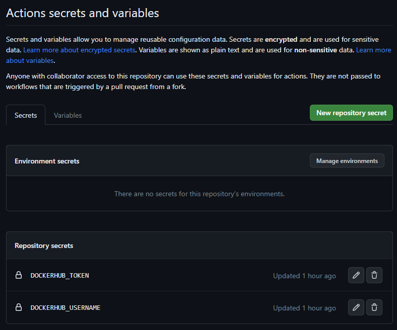
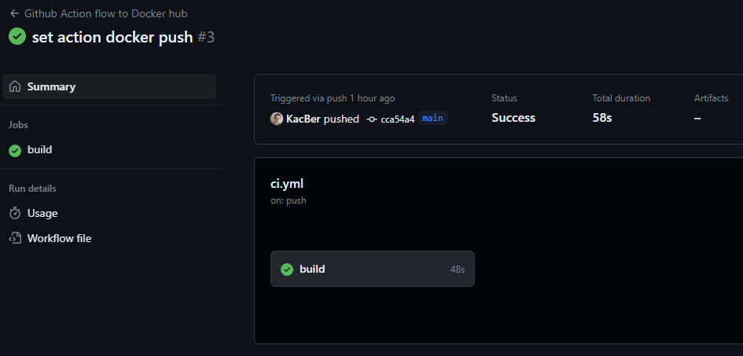
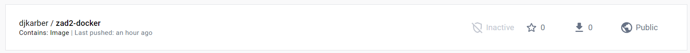

Do realizacji zadania 2 został wykorzystany program z zadania 1.

Aby zainicjować działanie Github Actions, został utworzony i umieszczony w katalogu .github/workflows plik ci.yml.

Opis pliku:

- **name** - definiuje nazwę łańcucha GitHub Actions.
- **on** - definiuje zdarzenie, które wyzwala uruchomienie łańcucha. W tym przypadku łańcuch zostanie uruchomiony po każdym pushu do gałęzi main.
- **jobs** - definiuje listę zadań do wykonania w ramach łańcucha.

Kolejne kroki łańcucha:

1. Actions checkout czyli pobranie kodu źródłowego z repozytorium.
2. Konfiguracja QEMU.
3. Konfiguracja Docker Buildx.
4. Logowanie do DockerHub. W celu logowania zostały na Githubie utworzone klucze actions secrets.

   

5. Budowanie i przesłanie obrazów kontenera.
   Parametr **context** wskazuje gdzie znajduje się kontekst budowania. Parametr **push** ustawiony na true wskazuje, że obrazy będą przesyłane na zewnętrzne repozytorium. Parametr **platforms** określa, dla jakich architektur będą budowane obrazy. Parametr **tags** definiuje tagi, które zostaną przypisane do zbudowanych obrazów kontenera.

Po zrobieniu pusha zostaje uruchomiony łańcuch.

Na Docker Hub został utworzony obraz.

